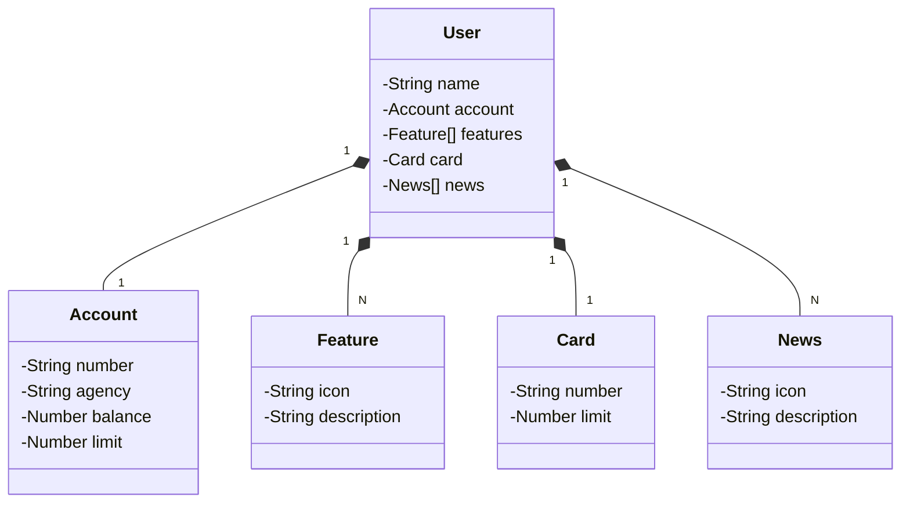

# Construção de API RESTful com deploy em nuvem com Railway

O projeto faz um mock da tela inicial do App do banco Santander, exibindo as informações sobre saldo, nome do cliente, entre outros detalhes da conta.

- Abstração inicial do domínio com Figma - [Referência](https://www.figma.com/design/0ZsjwjsYlYd3timxqMWlbj/SANTANDER---Projeto-Web%2FMobile)
- Diagrama de classes feito com ChatGPT e Mermaid - [Referência](https://github.com/falvojr/santander-dev-week-2023?tab=readme-ov-file#diagrama-de-classes-dom%C3%ADnio-da-api)

- Provisionamento do PostgreSQL (Railway) e criação do perfil de PRD
- Deploy da API na Nuvem(Railway)