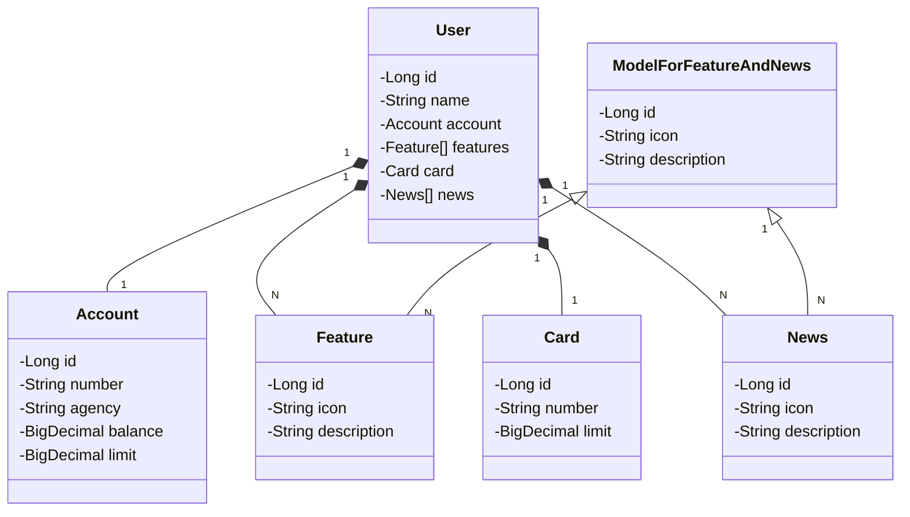

# Construção de API RESTful com deploy em nuvem com Railway

O projeto faz um mock da tela inicial do App do banco Santander, exibindo as informações sobre saldo, nome do cliente, entre outros detalhes da conta.

- Abstração inicial do domínio com Figma - [Referência](https://www.figma.com/design/0ZsjwjsYlYd3timxqMWlbj/SANTANDER---Projeto-Web%2FMobile)
- Diagrama de classes feito com ChatGPT e Mermaid - [Referência](https://github.com/falvojr/santander-dev-week-2023?tab=readme-ov-file#diagrama-de-classes-dom%C3%ADnio-da-api)



- Provisionamento do PostgreSQL (Railway) e criação do perfil de PRD
- Deploy da API na Nuvem(Railway)

Além disso, aprendi a configurar variáveis de ambiente pelo VSCode, com auxílio do Copilot. Eu tinha noção que era um arquivo próprio do VSCode, porém acreditava que precisava criar isso na extensão que utilizo para rodar aplicações Java. Para criar é bem simples Ctrl+P, ``>``, digitar "Depurar" e procurar a opção adicionar configuração. O arquivo JSON fica assim com a adicção da variável de ambiente identificada por ``env``:
```json
{
    // Use o IntelliSense para saber mais sobre os atributos possíveis.
    // Focalizar para exibir as descrições dos atributos existentes.
    // Para obter mais informações, acesse: https://go.microsoft.com/fwlink/?linkid=830387
    "version": "0.2.0",
    "configurations": [
        
        {
            "type": "java",
            "name": "Current File",
            "request": "launch",
            "mainClass": "${file}"
        },
        {
            "type": "java",
            "name": "ApiRestRailwayApplication",
            "request": "launch",
            "mainClass": "dio.apirestful.ApiRestRailwayApplication",
            "projectName": "api-rest-railway",
            "env": {
                "SPRING_PROFILES_ACTIVE": "dev"
              }
        }
    ]
}
```